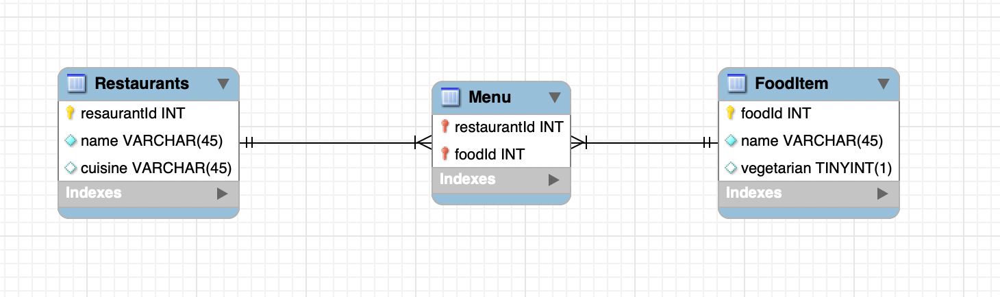

# Natural Language AI SQL Project



## Purpose

The purpose of this project is to integrate a basic database detailing restaurants and 
some of their basic food items with artificial intelligence to make querying the database
and interpreting responses easier. The database itself consists of three tables:
- Restaurant
- MenuItems
- FoodItem

These three tables will be explained in the following sections.

### Restaurant
This table stores an id for each restaurant, the name of that restaurant
as well as the cuisine type. For example, Olive Garden will have it's own ID and
be labeled as Italian.

### Menu
This table stores the restaurant ID and the food ID. This allows for only
one common food item to be created and have multiple restaurants point at it.

### Food Item
This table has an ID as well as a name and a vegetarian option for each food item. 
It is liked to restaurants through the menu table. 

## Different prompting strategies
One of the main issues we ran into was having our AI response not actually be formatted
in proper PostgreSQL format. About 1/4 results caused the program to crash. We then started
asking AI again if the previously generated PostgreSQL statement was valid and to have it 
edited if it was not. Once we implemented this we did not run into nearly as many issues.

Another strategy that we tried was one-shot querying versus zero-shot querying. In some of our queries,
particularly asking "Which restaurant offers the most high protein foods?", the program would
almost always trip up crash on trying to generate a query. The generated query often referenced
tables that did not exist. When we tried the one-shot approach however, the query did not try
to reference tables that did not exist and the response politely conveyed that no information was
available.

## Query that worked
Question: If I were a vegetarian, which restaurant would you recommend I go to?

SQL Statement:
```
SELECT r.name, r.cuisine
FROM Restaurants r
JOIN Menu m ON r.restaurantId = m.restaurantId
JOIN FoodItem f ON m.foodId = f.foodId
WHERE f.vegetarian = TRUE;
```

Friendly Response: The restaurants in the list are Olive Garden, Papa John's, Taco Bell, Buca De Beppo, and Carl's Jr. Among these options, you may want to try Olive Garden and Buca De Beppo for a more varied vegetarian menu.

## Query that didn't work
Question: Which restaurant offers the most high protein foods?

SQL Statement:
```
SELECT r.name AS restaurant_name, COUNT(f.foodId) AS high_protein_count
FROM Restaurants r
INNER JOIN Menu m ON r.restaurantId = m.restaurantId
INNER JOIN FoodItem f ON m.foodId = f.foodId
WHERE f.protein >= 20
GROUP BY r.name
ORDER BY high_protein_count DESC
LIMIT 1;
```

Friendly Response: (NA, the SELECT statement tried to come up with random data that wasn't in the database rather than interpreting food macros on its own)

### [Other Queries](additional_queries.md)
